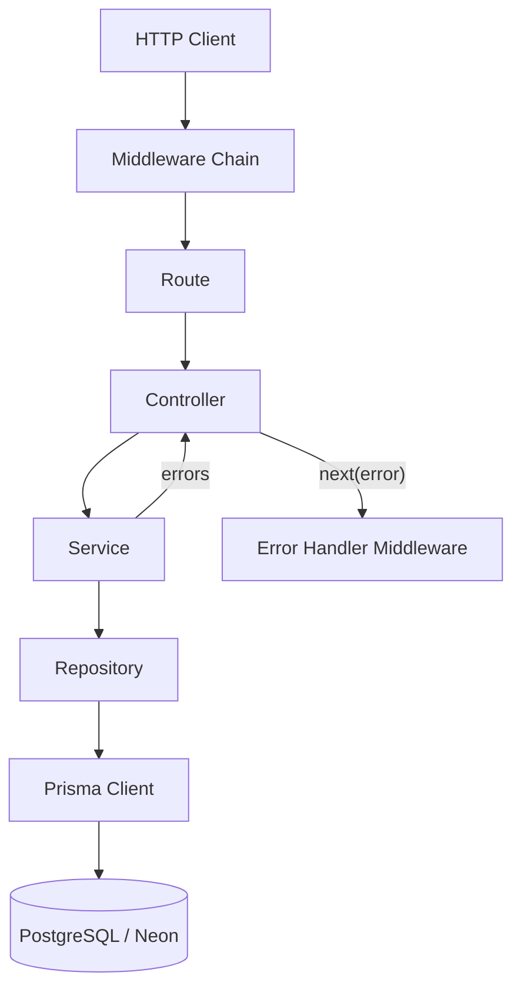
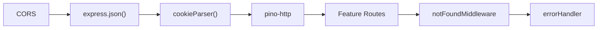
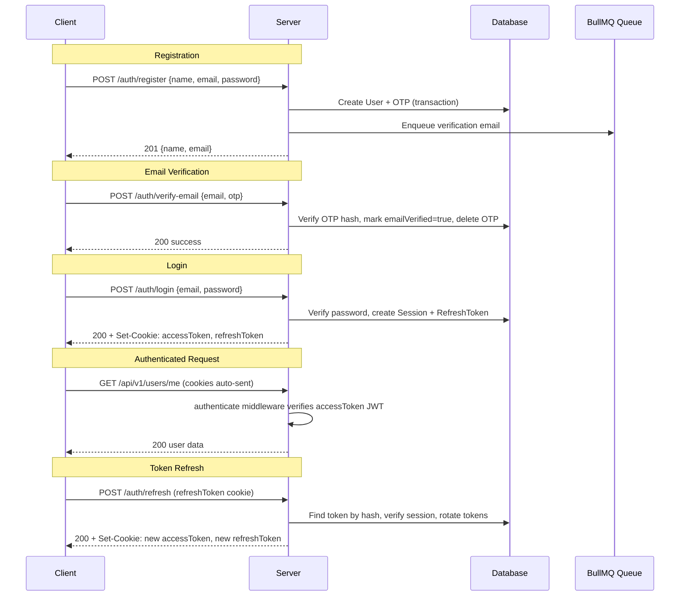
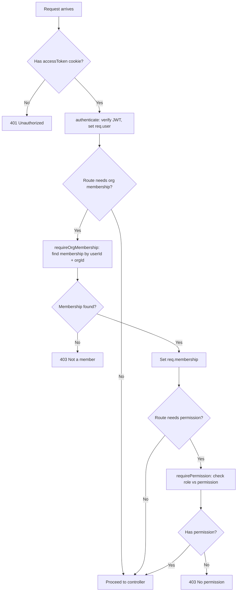
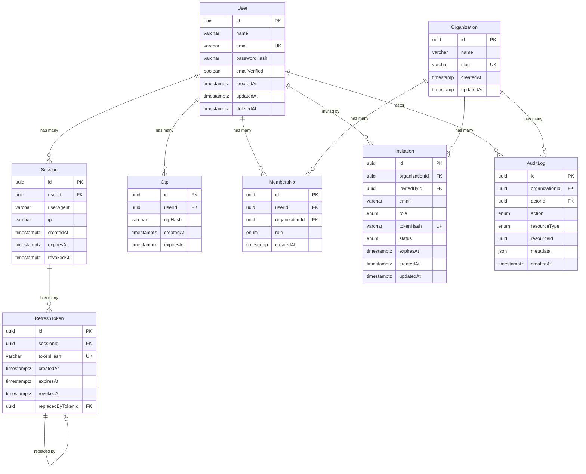
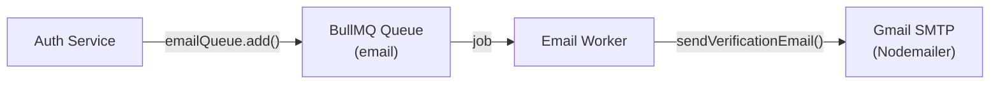
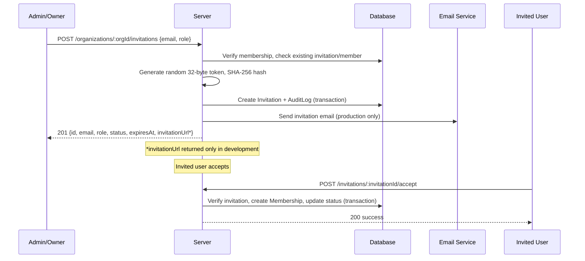

# Team Access Control API — Architecture Document

> **Important:** This repository is a **backend-only REST API**. There is no frontend application, no React/Next.js code, no UI components, and no client-side routing in this codebase. This document describes the **actual implemented architecture** of the backend API as it exists in the source code.

---

## 1. Technology Stack

| Layer              | Technology                                  | Version   | Purpose                                       |
| ------------------ | ------------------------------------------- | --------- | --------------------------------------------- |
| Runtime            | Node.js                                     | —         | JavaScript runtime                             |
| Language           | TypeScript                                  | 5.9+      | Strict type-safe development                   |
| Framework          | Express                                     | 5.2       | HTTP server and routing                        |
| ORM                | Prisma Client                               | 7.9       | Database access and schema management          |
| Database           | PostgreSQL (Neon)                            | —         | Primary data store (serverless via `@prisma/adapter-neon`) |
| Cache / Rate Limit | Upstash Redis (`@upstash/redis`)            | —         | Rate limiting via REST-based Redis             |
| Job Queue          | BullMQ + ioredis                            | 6.1 / 6.0 | Background email job processing                |
| Auth               | jsonwebtoken + bcryptjs                     | 9.0 / 3.0 | JWT creation/verification, password hashing    |
| Email              | Nodemailer                                  | 9.0       | Transactional email (Gmail SMTP)               |
| Validation         | Zod                                         | 4.4       | Request body/params/query validation           |
| Logging            | Pino + pino-http                            | 10.3      | Structured JSON logging                        |
| API Docs           | swagger-ui-express + @apidevtools/swagger-parser | 5.0 / 12.1 | OpenAPI 3.0 documentation               |
| Slug Generation    | slugify                                     | 1.6       | Organization slug creation                     |
| Testing            | Vitest + Supertest                          | 4.1 / 7.2 | Unit and integration testing                   |
| Dev Tooling        | tsx                                         | 4.23      | TypeScript execution without compilation       |

### Module System

The project uses **ES Modules** (`"type": "module"` in `package.json`). All internal imports use the `.js` extension suffix (e.g., `import { config } from "./config/env.config.js"`), which is required by Node.js ESM resolution with TypeScript.

---

## 2. Project Structure

```
team-access-control-api/
├── prisma/
│   ├── schema.prisma              # Database schema (models, enums, relations)
│   └── migrations/                # Prisma migration history
│
├── prisma.config.ts               # Prisma CLI configuration (datasource URL)
│
├── scripts/
│   └── test.ts                    # Test runner: resets test DB, then runs vitest
│
├── src/
│   ├── server.ts                  # Entry point: starts HTTP server, graceful shutdown
│   ├── app.ts                     # Express app: middleware registration, route mounting
│   │
│   ├── config/
│   │   ├── env.config.ts          # Zod-validated environment variables
│   │   ├── logger.config.ts       # Pino logger instance
│   │   ├── bullmqRedis.config.ts  # ioredis connection for BullMQ
│   │   ├── rateLimitRedis.config.ts # Upstash Redis client for rate limiting
│   │   ├── nodemailer.config.ts   # Gmail SMTP transporter
│   │   ├── swagger.config.ts      # Swagger spec bundler
│   │   ├── permissions.config.ts  # Permission string constants
│   │   └── rolePermission.config.ts # Role → permissions mapping
│   │
│   ├── db/
│   │   └── prisma.ts              # PrismaClient singleton (Neon adapter)
│   │
│   ├── middlewares/
│   │   ├── authentication.middleware.ts  # JWT access token verification
│   │   ├── authorization.middleware.ts   # Permission-based access control
│   │   ├── organization.middleware.ts    # Organization membership verification
│   │   ├── validate.middleware.ts        # Zod schema validation (body/params/query)
│   │   ├── error.middleware.ts           # Global error handler
│   │   ├── notFound.middleware.ts        # 404 catch-all handler
│   │   ├── logger.middleware.ts          # HTTP request/response logging
│   │   └── rate-limit/
│   │       ├── index.ts                  # Barrel export
│   │       ├── rateLimit.middleware.ts    # Generic Upstash rate limit middleware
│   │       ├── authLimiter.ts            # 10 req / 15 min (auth routes)
│   │       ├── organizationLimiter.ts    # 60 req / 15 min (org routes)
│   │       └── genericLimiter.ts         # 100 req / 15 min (unused, available)
│   │
│   ├── features/                  # Domain modules (route → controller → service → repository)
│   │   ├── auth/
│   │   ├── health/
│   │   ├── users/
│   │   ├── organizations/
│   │   ├── memberships/
│   │   ├── invitations/
│   │   ├── sessions/
│   │   └── audit-logs/
│   │
│   ├── queues/
│   │   └── email.queue.ts         # BullMQ queue definition for email jobs
│   │
│   ├── workers/
│   │   └── email.worker.ts        # BullMQ worker processing email jobs
│   │
│   ├── utils/
│   │   ├── appError.ts            # Custom error class with statusCode
│   │   ├── token.ts               # JWT creation, verification, SHA-256 hashing
│   │   ├── email.ts               # Email sending functions (verification, invitation)
│   │   └── generateSlug.ts        # slugify + random hex suffix
│   │
│   ├── types/
│   │   └── express.d.ts           # Express Request augmentation (user, membership, validated)
│   │
│   └── docs/
│       ├── openapi.yaml           # Root OpenAPI 3.0 spec
│       └── paths/                 # Per-resource OpenAPI path definitions
│           ├── auth.yaml
│           ├── user.yaml
│           ├── organizations.yaml
│           ├── memberships.yaml
│           ├── invitations.yaml
│           ├── sessions.yaml
│           └── audit-logs.yaml
│
├── tests/
│   ├── globalSetup.ts             # Vitest global setup: pushes schema to test DB
│   ├── setup.ts                   # Per-test-file setup: connect/disconnect Prisma
│   ├── integration/
│   │   └── auth/
│   │       └── register.test.ts   # Registration integration test
│   └── unit/                      # (empty — no unit tests yet)
│
├── package.json
├── tsconfig.json
├── vitest.config.ts
├── .env                           # Environment variables (not committed in practice)
└── .gitignore
```

---

## 3. Application Entry Points

### Main Server (`src/server.ts`)

The application starts from `src/server.ts`, which:

1. Imports and starts the Express `app` on the configured `PORT` (default 5000)
2. Imports the `emailWorker` to start BullMQ job processing in the same process
3. Implements graceful shutdown handling for `SIGINT`, `SIGTERM`, `uncaughtException`, and `unhandledRejection`
4. Shutdown sequence: close HTTP server → close BullMQ worker → quit BullMQ Redis → disconnect Prisma

### Express App (`src/app.ts`)

Configures the Express application in this order:

1. **CORS** — allows requests from `FRONTEND_URL` with `credentials: true`
2. **Body parsing** — `express.json()`
3. **Cookie parsing** — `cookie-parser`
4. **Request logging** — `pino-http` middleware
5. **Route mounting** — all feature routers at their respective paths
6. **Swagger UI** — served at `/api/v1/api-docs`
7. **404 handler** — catches unmatched routes
8. **Error handler** — global Express error handler (must be last)

### NPM Scripts

| Script       | Command                           | Purpose                            |
| ------------ | --------------------------------- | ---------------------------------- |
| `dev`        | `tsx watch src/server.ts`         | Development server with hot reload |
| `start`      | `node src/server.js`              | Production start (requires build)  |
| `test`       | `tsx scripts/test.ts`             | Reset test DB + run vitest         |
| `worker`     | `tsx src/workers/email.worker.ts` | Standalone email worker process    |

---

## 4. Feature Module Architecture

Every feature follows a consistent **4-layer pattern**:

```
feature/
├── feature.route.ts         # Express Router — defines endpoints, applies middleware
├── feature.controller.ts    # Request/response handling — extracts params, calls service, sends response
├── feature.service.ts       # Business logic — validation, orchestration, error throwing
├── feature.repository.ts    # Data access — Prisma queries and transactions
└── feature.validation.ts    # Zod schemas for request validation
```

**Data flows strictly downward:** Route → Controller → Service → Repository → Prisma



### Feature Modules

| Module         | Directory                  | Route File                   | Has Validation | Has Repository |
| -------------- | -------------------------- | ---------------------------- | -------------- | -------------- |
| Health         | `src/features/health/`     | `health.route.ts`            | No             | No             |
| Auth           | `src/features/auth/`       | `auth.route.ts`              | Yes            | Yes            |
| Users          | `src/features/users/`      | `user.route.ts`              | Yes            | No (uses auth repo) |
| Organizations  | `src/features/organizations/` | `organization.route.ts`   | Yes            | Yes            |
| Memberships    | `src/features/memberships/` | `membership.route.ts`       | Yes            | Yes            |
| Invitations    | `src/features/invitations/` | `invitation.route.ts`       | Yes            | Yes            |
| Sessions       | `src/features/sessions/`   | `session.route.ts`           | Yes            | Yes            |
| Audit Logs     | `src/features/audit-logs/` | `audit-log.route.ts`         | Yes            | Yes            |

> **Note:** The `users` feature does not have its own repository. It imports `getUserById`, `updateUserById`, and `softDeleteUserById` from `auth.repository.ts`.

---

## 5. API Route Map

**Base URL:** `/api/v1`

### Health

| Method | Path       | Auth | Rate Limit | Middleware Chain       |
| ------ | ---------- | ---- | ---------- | ---------------------- |
| GET    | `/health`  | None | None       | —                      |

### Authentication (`/auth`)

Rate limit: **10 requests / 15 min** per IP (sliding window)

| Method | Path            | Auth | Body                              | Description                          |
| ------ | --------------- | ---- | --------------------------------- | ------------------------------------ |
| POST   | `/auth/register` | None | `{ name, email, password }`      | Register user, send OTP via BullMQ   |
| POST   | `/auth/verify-email` | None | `{ email, otp }`            | Verify email with 6-digit OTP        |
| POST   | `/auth/login`   | None | `{ email, password }`             | Login, set cookie tokens, create session |
| POST   | `/auth/refresh` | Cookie | None                           | Rotate refresh + access tokens       |

### Users (`/users`)

No rate limiter applied.

| Method | Path        | Auth   | Body           | Description                  |
| ------ | ----------- | ------ | -------------- | ---------------------------- |
| GET    | `/users/me` | Cookie | —              | Get current user profile     |
| PATCH  | `/users/me` | Cookie | `{ name }`     | Update current user's name   |
| DELETE | `/users/me` | Cookie | —              | Soft-delete current user     |

### Organizations (`/organizations`)

Rate limit: **60 requests / 15 min** per IP

| Method | Path                          | Auth   | Permission             | Body           | Description                                 |
| ------ | ----------------------------- | ------ | ---------------------- | -------------- | ------------------------------------------- |
| POST   | `/organizations`              | Cookie | —                      | `{ name }`     | Create org + OWNER membership (transaction) |
| GET    | `/organizations`              | Cookie | —                      | —              | List user's organizations                   |
| GET    | `/organizations/:orgId`       | Cookie | —                      | —              | Get single organization                     |
| PATCH  | `/organizations/:orgId`       | Cookie | `organization:update`  | `{ name }`     | Update organization name                    |
| DELETE | `/organizations/:orgId`       | Cookie | `organization:delete`  | —              | Delete organization                         |

### Memberships (`/organizations/:organizationId/members`)

| Method | Path                                          | Auth   | Permission           | Body           | Description             |
| ------ | --------------------------------------------- | ------ | -------------------- | -------------- | ----------------------- |
| GET    | `/organizations/:orgId/members`               | Cookie | `member:read`        | —              | List all members        |
| GET    | `/organizations/:orgId/members/:memberId`     | Cookie | — (no org check)     | —              | Get single membership   |
| PATCH  | `/organizations/:orgId/members/:memberId`     | Cookie | `member:update-role`  | `{ role }`    | Change member's role    |
| DELETE | `/organizations/:orgId/members/me`            | Cookie | — (no org check)     | —              | Leave organization      |
| DELETE | `/organizations/:orgId/members/:memberId`     | Cookie | `member:remove`      | —              | Remove a member         |

### Invitations

| Method | Path                                                      | Auth   | Permission           | Body                | Description                  |
| ------ | --------------------------------------------------------- | ------ | -------------------- | ------------------- | ---------------------------- |
| GET    | `/invitations`                                            | Cookie | —                    | —                   | List user's received invitations |
| POST   | `/organizations/:orgId/invitations`                       | Cookie | `invitation:create`  | `{ email, role }`   | Create and send invitation   |
| GET    | `/organizations/:orgId/invitations`                       | Cookie | `invitation:read`    | —                   | List org's invitations       |
| DELETE | `/organizations/:orgId/invitations/:invitationId`         | Cookie | `invitation:delete`  | —                   | Revoke invitation            |
| POST   | `/invitations/:invitationId/accept`                       | Cookie | —                    | —                   | Accept invitation            |
| POST   | `/invitations/:invitationId/reject`                       | Cookie | —                    | —                   | Reject invitation            |

### Sessions (`/sessions`)

| Method | Path                    | Auth   | Body | Description           |
| ------ | ----------------------- | ------ | ---- | --------------------- |
| GET    | `/sessions`             | Cookie | —    | List all user sessions |
| DELETE | `/sessions/:sessionId`  | Cookie | —    | Delete specific session |
| DELETE | `/sessions`             | Cookie | —    | Delete all sessions    |

### Audit Logs (`/organizations/:organizationId/audit-logs`)

| Method | Path                                                  | Auth   | Permission         | Query Params                               | Description        |
| ------ | ----------------------------------------------------- | ------ | ------------------ | ------------------------------------------ | ------------------ |
| GET    | `/organizations/:orgId/audit-logs`                    | Cookie | `audit-log:read`   | `page`, `limit`, `action`, `actorId`, `resourceType` | Paginated audit logs |
| GET    | `/organizations/:orgId/audit-logs/:auditLogId`        | Cookie | `audit-log:read`   | —                                          | Single audit log   |

---

## 6. Middleware Pipeline

### Global Middleware (applied to all routes, in order)



### Per-Route Middleware Chain

Protected organization routes use this chain:

```
rateLimit(limiter) → authenticate → requireOrgMembership → requirePermission(perm) → validate(schema) → controller
```

| Middleware             | File                                | Purpose                                                       |
| ---------------------- | ----------------------------------- | ------------------------------------------------------------- |
| `rateLimit(limiter)`   | `rate-limit/rateLimit.middleware.ts` | IP-based rate limiting via Upstash Redis; sets `X-RateLimit-*` headers |
| `authenticate`         | `authentication.middleware.ts`      | Reads `accessToken` cookie, verifies JWT, sets `req.user`     |
| `requireOrgMembership` | `organization.middleware.ts`        | Reads `:organizationId` param, finds membership, sets `req.membership` |
| `requirePermission`    | `authorization.middleware.ts`       | Checks `req.membership.role` against permission config        |
| `validate(schema)`     | `validate.middleware.ts`            | Validates `req.body`/`req.params`/`req.query` with Zod, sets `req.validated` |
| `errorHandler`         | `error.middleware.ts`               | Catches `AppError` instances, returns `{ success: false, message }` |
| `notFoundMiddleware`   | `notFound.middleware.ts`            | Catches unmatched routes, throws `AppError(404)`               |

### Express Request Augmentation (`src/types/express.d.ts`)

The Express `Request` type is augmented with:

```typescript
interface Request {
  user?: { id: string; sessionId: string };
  membership?: { id: string; userId: string; organizationId: string; role: Role };
  validated?: { body?: unknown; params?: unknown; query?: unknown };
}
```

---

## 7. Authentication System

### Mechanism

**Dual HttpOnly cookie** authentication with JWT:

- `accessToken` cookie — JWT (15 min TTL), contains `{ sub: userId, sessionId, type: "access" }`
- `refreshToken` cookie — JWT (30 days TTL), stored as SHA-256 hash in the `refresh_tokens` DB table
- Both cookies: `httpOnly: true`, `sameSite: "lax"`, `secure: true` in production only
- No `Authorization: Bearer` header — cookies only

### Authentication Flow



### Token Rotation

The refresh flow implements **token rotation with revocation**:

1. Client sends `POST /auth/refresh` with the `refreshToken` cookie
2. Server hashes the token with SHA-256, looks up the stored `RefreshToken` record
3. Validates: not expired, not revoked, associated session not revoked/expired
4. Marks the old refresh token as revoked (`revokedAt`)
5. Creates a new `RefreshToken` record and links them (`replacedByTokenId`)
6. Issues new access + refresh JWTs as cookies

### Password Hashing

Passwords are hashed with `bcryptjs` using 12 salt rounds.

### OTP Verification

- 6-digit numeric OTP, hashed with bcrypt before storage
- Expires after 10 minutes
- On verification: marks user's `emailVerified = true` and deletes the OTP record (in a transaction)

---

## 8. Authorization / RBAC

### Roles

Three roles are defined as a Prisma enum: `OWNER`, `ADMIN`, `MEMBER`.

### Role → Permission Matrix

| Permission              | OWNER | ADMIN | MEMBER |
| ----------------------- | ----- | ----- | ------ |
| `organization:read`     | ✅    | ✅    | ✅     |
| `organization:update`   | ✅    | ❌    | ❌     |
| `organization:delete`   | ✅    | ❌    | ❌     |
| `member:read`           | ✅    | ✅    | ✅     |
| `member:update-role`    | ✅    | ✅    | ❌     |
| `member:remove`         | ✅    | ✅    | ❌     |
| `invitation:read`       | ✅    | ✅    | ❌     |
| `invitation:create`     | ✅    | ✅    | ❌     |
| `invitation:delete`     | ✅    | ✅    | ❌     |
| `audit-log:read`        | ✅    | ✅    | ❌     |

This mapping is defined in `src/config/rolePermission.config.ts` and checked by the `requirePermission` middleware.

### Authorization Flow



---

## 9. Database Schema

### Entity Relationship Diagram



### Enums

```
Role:              OWNER | ADMIN | MEMBER
InvitationStatus:  PENDING | ACCEPTED | REJECTED | EXPIRED
AuditAction:       MEMBER_INVITED | MEMBER_JOINED | MEMBER_REMOVED | MEMBER_LEFT | 
                   ROLE_CHANGED | INVITATION_REJECTED | INVITATION_REVOKED | ORGANIZATION_UPDATED
AuditResourceType: ORGANIZATION | MEMBERSHIP | INVITATION
```

### Database Connection

The Prisma client uses the `@prisma/adapter-neon` driver adapter, connecting to Neon's serverless PostgreSQL via the `DATABASE_URL` connection string.

---

## 10. Background Job Processing

### Email Queue

The application uses **BullMQ** for asynchronous email delivery.



| Component    | File                            | Details                                           |
| ------------ | ------------------------------- | ------------------------------------------------- |
| Queue        | `src/queues/email.queue.ts`     | Queue name: `"email"`, 3 attempts, exponential backoff (5s) |
| Worker       | `src/workers/email.worker.ts`   | Processes `"send-verification-email"` jobs        |
| Connection   | `src/config/bullmqRedis.config.ts` | ioredis connecting to Upstash Redis (TLS)      |

**Job types:**

| Job Name                    | Data                      | Action                    |
| --------------------------- | ------------------------- | ------------------------- |
| `send-verification-email`   | `{ email, otp }`          | Sends OTP email via Gmail |

**Queue settings:**
- 3 retry attempts with exponential backoff (5 second base delay)
- Retains last 100 completed jobs
- Retains last 500 failed jobs

> **Note:** The email worker runs in the same process as the HTTP server (imported in `server.ts`). It can also be started as a standalone process via `npm run worker`.

---

## 11. Rate Limiting

Rate limiting uses **Upstash Redis** via the `@upstash/ratelimit` package with a **sliding window** algorithm.

| Limiter                | Config                    | Applied To              |
| ---------------------- | ------------------------- | ----------------------- |
| `authLimiter`          | 10 requests / 15 minutes  | `/api/v1/auth/*`        |
| `organizationLimiter`  | 60 requests / 15 minutes  | `/api/v1/organizations/*` |
| `genericLimiter`       | 100 requests / 15 minutes | Not currently applied   |

**Identifier:** Client IP address (`req.ip ?? "unknown"`)

**Response headers set on every rate-limited request:**
- `X-RateLimit-Limit`
- `X-RateLimit-Remaining`
- `X-RateLimit-Reset`

---

## 12. Request Validation

Validation uses Zod schemas via the `validate` middleware. The middleware validates up to three request sources: `body`, `params`, and `query`.

### Validation Middleware Behavior

1. Parses each source against its Zod schema using `safeParse`
2. On failure: returns `400` with `{ success: false, message: "body validation failed", errors: flattenedErrors }`
3. On success: stores parsed data on `req.validated[source]`

### Validation Schemas by Feature

| Feature       | Schema Name                   | Validates                              |
| ------------- | ----------------------------- | -------------------------------------- |
| Auth          | `registerUserSchema`          | `body: { name(min:3), email, password(8-30) }` |
| Auth          | `loginUserSchema`             | `body: { email, password(8-30) }`      |
| Auth          | `verifyUserSchema`            | `body: { email, otp(exactly 6 digits) }` |
| Users         | `updateUserSchema`            | `body: { name(3-30) }`                |
| Organizations | `createOrganizationSchema`    | `body: { name(3-255) }`               |
| Organizations | `organizationIdSchema`        | `params: { organizationId: uuid }`     |
| Memberships   | `roleSchema`                  | `body: { role: OWNER\|ADMIN\|MEMBER }` |
| Memberships   | `membershipParamsSchema`      | `params: { organizationId: uuid, memberId: uuid }` |
| Invitations   | `invitationParamSchema`       | `params: { organizationId: uuid }`     |
| Invitations   | `invitationBodySchema`        | `body: { email, role }`                |
| Invitations   | `invitationDeleteParamSchema` | `params: { organizationId: uuid, invitationId: uuid }` |
| Invitations   | `invitationIdParamsSchema`    | `params: { invitationId: uuid }`       |
| Sessions      | `deleteSessionSchema`         | `params: { sessionId: uuid }`          |
| Audit Logs    | `getAuditLogsQuerySchema`     | `query: { page(default:1), limit(default:10, max:100), action?, actorId?, resourceType? }` |
| Audit Logs    | `getAuditLogParamSchema`      | `params: { auditLogId: uuid, organizationId: uuid }` |

---

## 13. Error Handling

### AppError Class (`src/utils/appError.ts`)

```typescript
class AppError extends Error {
  statusCode: number;
  constructor(message: string, statusCode: number) { ... }
}
```

### Error Response Format

**Standard errors:**
```json
{ "success": false, "message": "Human-readable error message" }
```

**Validation errors (400):**
```json
{
  "success": false,
  "message": "body validation failed",
  "errors": { "fieldErrors": { "field": ["message"] }, "formErrors": [] }
}
```

**Rate limit (429):**
```json
{ "success": false, "message": "Too many requests. Please try again later." }
```

### Error Handler (`src/middlewares/error.middleware.ts`)

The global error handler reads `err.statusCode` (defaulting to 500) and returns the standardized JSON response. Only `AppError` instances carry proper status codes.

---

## 14. Audit Logging

Audit logs are created **within database transactions** alongside the mutating operations they track. This ensures atomicity — if the mutation fails, no audit log is created, and vice versa.

### Audited Operations

| Action               | Resource Type  | Trigger                                   |
| -------------------- | -------------- | ----------------------------------------- |
| `MEMBER_INVITED`     | `INVITATION`   | Creating an invitation                    |
| `MEMBER_JOINED`      | `MEMBERSHIP`   | Accepting an invitation                   |
| `MEMBER_REMOVED`     | `MEMBERSHIP`   | Admin/owner removing a member             |
| `MEMBER_LEFT`        | `MEMBERSHIP`   | Member leaving an organization            |
| `ROLE_CHANGED`       | `MEMBERSHIP`   | Changing a member's role                  |
| `INVITATION_REJECTED`| `INVITATION`   | User rejecting an invitation              |
| `INVITATION_REVOKED` | `INVITATION`   | Admin/owner revoking an invitation        |

### Audit Log Query Support

The `GET /organizations/:orgId/audit-logs` endpoint supports:
- **Pagination:** `page` and `limit` (max 100)
- **Filtering:** by `action`, `actorId`, `resourceType`
- **Response includes:** actor's `{ id, name, email }` via Prisma `include`

---

## 15. Invitation System

### Invitation Flow



**Key details:**
- Invitation tokens: 32 random bytes → hex string (64 chars), stored as SHA-256 hash
- Invitation expiry: 7 days
- Invitation URL format: `{FRONTEND_URL}/invitations/{rawToken}/accept`
- In development mode, the `invitationUrl` is included in the API response
- In production, an invitation email is sent instead
- Invitation statuses: `PENDING` → `ACCEPTED` or `REJECTED`

---

## 16. Organization Slug Generation

Organization slugs are generated using `slugify` + a random 12-character hex suffix:

```typescript
function generateSlug(name: string): string {
  const baseSlug = slugify(name, { lower: true, strict: true, trim: true });
  const suffix = crypto.randomBytes(6).toString("hex");
  return `${baseSlug}-${suffix}`;
}
```

The service retries up to 3 times on unique constraint violations (`Prisma P2002`), generating a new suffix each time.

---

## 17. Logging

### Configuration (`src/config/logger.config.ts`)

- **Library:** Pino (structured JSON logging)
- **Log level:** Configurable via `LOG_LEVEL` env var (default: `"info"`)
- **Development:** Uses `pino-pretty` for human-readable colored output
- **Production:** Raw JSON output (no transport)
- **Redacted fields:** `req.headers.authorization`, `req.headers.cookie`, `res.headers.set-cookie`

### HTTP Logging (`src/middlewares/logger.middleware.ts`)

- Uses `pino-http` middleware
- Custom log levels: 5xx → `error`, 4xx → `warn`, others → `info`
- Serializes request to: `{ id, method, url, remoteAddress }`
- Serializes response to: `{ statusCode }`

---

## 18. Environment Configuration

All environment variables are validated at startup using Zod (`src/config/env.config.ts`). If validation fails, the process exits immediately.

| Variable                   | Type      | Default        | Purpose                                    |
| -------------------------- | --------- | -------------- | ------------------------------------------ |
| `PORT`                     | string    | `"3000"`       | HTTP server port                           |
| `NODE_ENV`                 | enum      | `"development"` | Environment mode                          |
| `FRONTEND_URL`             | url       | —              | CORS origin, invitation URL base           |
| `DATABASE_URL`             | string    | —              | PostgreSQL connection string (Neon)        |
| `TEST_DATABASE_URL`        | string    | —              | Test database connection string            |
| `ACCESS_TOKEN_SECRET`      | string    | —              | JWT signing secret for access tokens       |
| `REFRESH_TOKEN_SECRET`     | string    | —              | JWT signing secret for refresh tokens      |
| `ACCESS_TOKEN_EXPIRES_IN`  | string    | `"15m"`        | Access token TTL                           |
| `REFRESH_TOKEN_EXPIRES_DAYS` | string  | `"30"`         | Refresh token TTL in days                  |
| `SMTP_USER`                | email     | —              | Gmail sender address                       |
| `SMTP_PASSWORD`            | string    | —              | Gmail app password                         |
| `UPSTASH_REDIS_REST_URL`   | string    | —              | Upstash Redis REST URL (rate limiting)     |
| `UPSTASH_REDIS_REST_TOKEN` | string    | —              | Upstash Redis REST token                   |
| `UPSTASH_REDIS_URL`        | string    | —              | Upstash Redis URL (BullMQ, ioredis)        |
| `LOG_LEVEL`                | enum      | `"info"`       | Pino log level                             |
| `API_DOCS_USERNAME`        | string    | —              | Swagger UI basic auth username             |
| `API_DOCS_PASSWORD`        | string    | —              | Swagger UI basic auth password (min 8 chars) |

> **Note:** `ACCESS_TOKEN_EXPIRES_IN` and `REFRESH_TOKEN_EXPIRES_DAYS` are defined in the env config schema but the actual token expiry is **hardcoded** in `src/utils/token.ts` as `15 * 60` seconds (access) and `30 * 24 * 60 * 60` seconds (refresh). The env vars are not consumed at token creation time.

---

## 19. Testing Architecture

### Framework

- **Vitest** for test runner
- **Supertest** for HTTP integration tests (available but only one test exists)

### Test Setup

| File                      | Purpose                                                |
| ------------------------- | ------------------------------------------------------ |
| `vitest.config.ts`        | Points to `globalSetup.ts` and `setup.ts`              |
| `tests/globalSetup.ts`    | Runs `prisma db push` against `TEST_DATABASE_URL`      |
| `tests/setup.ts`          | `beforeAll`: connect Prisma; `afterAll`: disconnect     |
| `scripts/test.ts`         | Full test script: `prisma migrate reset --force` on test DB, then `vitest run` |

### Test Script (`npm test`)

The `scripts/test.ts` script:
1. Reads `TEST_DATABASE_URL` from env
2. Runs `prisma migrate reset --force` against the test database (clean slate)
3. Runs `vitest run` with `DATABASE_URL` set to the test database URL

### Current Test Coverage

Only one integration test exists:
- `tests/integration/auth/register.test.ts` — Registration endpoint tests

---

## 20. API Documentation

The API is documented using **OpenAPI 3.0** specification:

- **Root spec:** `src/docs/openapi.yaml`
- **Path definitions:** split into per-resource YAML files under `src/docs/paths/`
- **Bundler:** `@apidevtools/swagger-parser` bundles multi-file specs
- **UI:** `swagger-ui-express` serves the interactive docs at `/api/v1/api-docs`
- **Security scheme:** `cookieAuth` (apiKey in cookie named `accessToken`)

---

## 21. Graceful Shutdown

The server implements a comprehensive graceful shutdown sequence (`src/server.ts`):

1. **Stop accepting connections** — `server.close()`
2. **Stop BullMQ worker** — `emailWorker.close()` (waits for running jobs)
3. **Close BullMQ Redis** — `bullmqRedis.quit()`
4. **Disconnect Prisma** — `prisma.$disconnect()`
5. **Force exit** — if shutdown takes longer than 30 seconds

Handles: `SIGINT`, `SIGTERM`, `uncaughtException`, `unhandledRejection`

---

## 22. CORS Configuration

CORS is configured in `app.ts`:

```typescript
cors({
  origin: config.FRONTEND_URL,
  credentials: true,
})
```

- Only allows requests from the configured `FRONTEND_URL` (default: `http://localhost:3000`)
- `credentials: true` enables cross-origin cookie sending/receiving

---

## 23. Key Architectural Decisions

1. **Feature-based module structure** — Each domain (auth, organizations, memberships, etc.) is self-contained with its own route, controller, service, repository, and validation files. Cross-feature imports are permitted at the repository level (e.g., invitation service imports from membership and organization repositories).

2. **Repository pattern** — All database access is encapsulated in repository files. Controllers and services never import Prisma directly.

3. **Transactional audit logging** — Audit log creation is embedded within the same Prisma `$transaction` as the mutation it records, ensuring atomicity.

4. **Cookie-only authentication** — No bearer tokens or localStorage. All auth state is managed via HttpOnly cookies, making the API suitable for browser-based clients.

5. **Separate Redis connections** — The project uses two different Redis client libraries: `ioredis` for BullMQ (requires persistent TCP connection) and `@upstash/redis` (REST-based) for rate limiting. They connect to the same Upstash Redis instance via different protocols.

6. **Soft delete for users** — Users are soft-deleted by setting `deletedAt`. Login checks for `deletedAt !== null` and rejects soft-deleted users.

7. **In-process worker** — The BullMQ email worker runs in the same Node.js process as the HTTP server by default. A dedicated worker process can be started separately via `npm run worker`.

---

## 24. Standard API Response Format

**Success responses:**
```json
{
  "success": true,
  "message": "Descriptive success message",
  "data": { ... }
}
```

**Error responses:**
```json
{
  "success": false,
  "message": "Descriptive error message"
}
```

**Validation error responses (400):**
```json
{
  "success": false,
  "message": "body validation failed",
  "errors": {
    "fieldErrors": { "name": ["Name must be at least 3 characters long"] },
    "formErrors": []
  }
}
```
